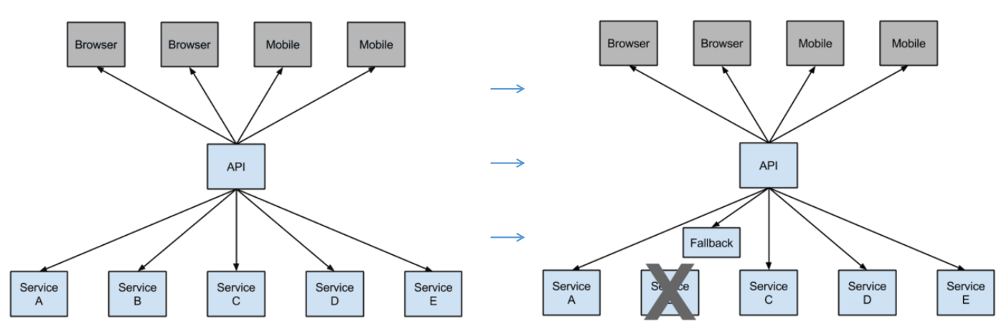

## *Redis*

*Redis :REmote DIctionary Server* 远程字典服务器

小数点后第一个数字: 偶数为稳定版, 奇数为非稳定版

redis属于单线程, 不用担心并发问题

key名称最佳实践: 对象类型:对象ID:对象属性, 如 user:1:name

id生成策略最佳实践: `incr 对象类型:count`

hash中的键和值必须都是字符串, 不能嵌套其他类型数据, 最多容纳2^32 - 1个元素

redis中的除字符串外的数据类型都不支持类型嵌套, 必须为字符串

list内部使用双向链表,  最多容纳2^32 - 1个元素

set内部使用hash的key实现, 最多容纳2^32 - 1个元素

zset与list的区别

|              | List(列表) | ZSet(有序集合)                              |
| ------------ | ---------- | ------------------------------------------- |
| 相同点       | 有序       | 有序                                        |
| 数据结构     | 双向链表   | 散列表和跳跃表(Skip list), 使用分数指定顺序 |
| 元素移动位置 | 不予许     | 更改元素分数                                |
| 内存开销     | 小         | 大                                          |

事务

- MULTI --> EXEC
- 多条语句的错误处理
  - 语法错误: 2.6.5前 忽略; 2.6.5后 所有不执行(回滚)
  - 运行错误(类型/指令错误, 如字符串类型使用散列指令, 语法正确但运行错误): 忽略错误继续执行
- WATCH: 观察某值发生变化, 后续事务不处理
- 事务处理结束, WATCH值自动UNWATCH
- UNWATCH: 取消观察某值


## *MySQL*

第一章

读写锁: 读锁(共享锁)和写锁(排他锁)

- 读锁是共享的, 多个线程可以同时获得读锁(同时读取资源)
- 写锁是排他的, 同一时刻只能有一个线程获得写锁, 并**阻塞其他读锁和写锁**. 阻塞读锁的目的实为了防止读取正在写入的资源

锁粒度: 锁定数据量越少, 并发程度越高(盈亏处理时的锁定就是很好的排他锁例子)

MySQL锁策略: 表锁和行锁

- 表锁: 读操作相互不阻塞, 写操作需要先获得写锁, 并阻塞其他读锁和写锁

死锁: 两个事物对两行数据分别先后和后先执行. 解决方式为让一个事物回滚, 然后再执行

第五章 - 141

索引在存储引擎层实现

不同的存储引擎有不同的索引实现, 同一种索引在不同的存储引擎上也有不同实现

B-Tree索引内部结构, 参考: 高性能MySQL第3版 179页(页面149页)

B-Tree索引使用与 =, >=, <=, like 'a%'进行查找, 因为B-Tree索引按顺序排列

索引不仅可以用于where查询, 还可以用于order by排序

哈希索引, memory引擎默认索引

触发器, 某个列值发生改变, 对应列的值也改变

第七章 - 259

第六章 - 195


## *SpringCloud*

版本号采用伦敦地铁站名称按照字母排序

#### Eureka

- 注册中心, 类似于zookeeper

- server服务端

  - pom文件添加`eureka-server`依赖
  - Application类上添加`@EnableEurekaServer`注解
  - application.yml配置

      ```yml
      eureka:
        instance:
            hostname: localhost
        client:
            registerWithEureka: false # 表示当前服务不是eureka客户端, 而是服务端
            fetchRegistry: false # 表示当前服务不是eureka客户端, 而是服务端
            serviceUrl:
                defaultZone: http://${eureka.instance.hostname}:${server.port}/eureka/
      ```

- client客户端
  - pom文件添加`eureka-client`依赖

  - Application类上添加`@EnableEurekaClient`注解

  - application.yml配置

    ```yml
    eureka:
    	client:
          registerWithEureka: true # 默认为true
          fetchRegistry: true # 默认为true
          serviceUrl:
              defaultZone: http://localhost:{eureka-server.port}/eureka/
    ```


#### 服务调用(Ribbon+RestTemplate)

- ribbon: 集成负载均衡, 按照一定策略访问集群服务提供者

- 配置步骤

    - pom文件添加`ribbon`依赖

    - Application注入负载均衡的RestTemplate

      ```java
      @Bean
      @LoadBalanced
      RestTemplate restTemplate() {
          return new RestTemplate();
      }
      ```

    - application.yml无需添加额外配置, 只需包含application-name, eureka-client配置即可

- 调用步骤

  ```java
  // 业务bean内部
  
  // 注入restTemplate
  @Autowired
  private RestTemplate restTemplate;
  
  // 业务方法调用
  public String 业务方法(String args) {
      return restTemplate.getForObject("http://服务提供者application-name/接口", 返回值类型.class);
  }
  ```

- 架构体系

  

   - 一个服务注册中心, eureka server, 端口为8761
  
   - service-hi工程跑了两个实例, 端口分别为8762,8763, 分别向服务注册中心注册
  
   - sercvice-ribbon端口为8764, 向服务注册中心注册
  
   - 当sercvice-ribbon通过restTemplate调用service-hi的hi接口时，因为用ribbon进行了负载均衡，会轮流的调用service-hi：8762和8763 两个端口的hi接口

#### 服务调用(Feign)

- feign已经集成了ribbon, 具有负载均衡能力
- feign集成了hystrix, 具有熔断能力
- 采用基于接口的注解

- 配置步骤

  - pom中添加依赖`openfeign`
  - Application类中添加`@EnableFeignClients`注解
  - application.yml无需添加额外配置, 只需包含application-name, eureka-client配置即可

- 调用步骤

  - 添加一个接口, 例: FeignInterface

    ```java
    @FeignClient(value = "服务提供者application-name")
    @Repository // 可以不添加, 主要用于消除编译器报错
    public interface FeignInterface {
        // 添加需要调用的远程服务接口
        @GetMapping(path = "远程服务接口")
        String methodName(@RequestParam String 参数名);
    }
    ```

  - 在需要调用远程服务的bean中添加

    ```java
    // 业务bean内部
    
    @Autowired
    private FeignInterface feignImpl;
    
    // 业务方法
    public String 业务方法(String args) {
    	// ...
        feignImpl.methodName(参数);
        // ...
    }
    ```

#### 断路器(hystrix)

- 调用服务不可用达到阈值(5秒20次不可用), 断路器启用



- 配置步骤(Ribbon)

  - pom文件中添加`hystrix`依赖
  - Application类中添加`@EnableHystrix`注解
  - application.yml中无需添加额外配置

- 调用步骤(Ribbon)

  ```java
  // 业务bean内部
  
  // 注入restTemplate
  @Autowired
  private RestTemplate restTemplate;
  
  // 业务方法调用
  @HystrixCommand(fallbackMethod = "error")
  public String 业务方法(String args) {
      return restTemplate.getForObject("http://服务提供者application-name/接口", 返回值类型.class);
  }
  
  // 发生熔断时调用该方法
  public String error(String args) {
      return "服务发生错误";
  }
  ```

- 配置步骤(Feign)

  - pom文件无需添加额外依赖

  - Application类无需添加额外配置

  - application.yml中添加如下配置

    ```yml
    feign.hystrix.enabled=true
    ```

- 调用步骤(Feign)

  - 对FeignInterface接口进行修改, `@FeignClient`注解添加fallback属性, 其余不变

    ```java
    @FeignClient(value = "服务提供者application-name", fallback = FeignCallbackImpl.class)
    @Repository // 可以不添加, 主要用于消除编译器报错
    public interface FeignInterface {
        // 添加需要调用的远程服务接口
        @GetMapping(path = "远程服务接口")
        String methodName(@RequestParam String 参数名);
    }
    ```

  - 基于FeignInterface接口提供实现类

    ```java
    @Component
    public Class FeignCallbackImpl implements FeignInterface {
        @Override
        public String methodName(String 参数名) {
            return "服务发生错误";
        }
    }
    ```

#### 路由网关(Zuul)

- 主要功能: 路由转发和过滤器

- zuul-service配置步骤

  - pom文件添加`zuul`依赖

  - Application类中添加`@EnableZuulProxy`注解

  - application.yml文件添加配置

    ```yml
    # 已忽略 eureka-client配置, 端口配置, application-name配置
    zuul:
    	routes:
    		{名称}:
    			path: /{名称}/**
    			serviceId: 服务消费名称
    		{名称}:
    			path: /{名称}/**
    			serviceId: 服务消费名称
    ```

- 服务过滤器

  ```java
  // 创建服务过滤器类, 对请求和响应进行拦截
  @Component
  public class MyFilter extends ZuulFilter {
      @Override
      public String filterType() {
          // 拦截类型(切点): 前置/路由时/后置/错误
          return "pre" || "routing" || "post" || "error";
      }
      
      @Override
      public int filterOrder() {
  		// 拦截顺序, 数值越小越在前拦截
          return 0;
      }
      
      @Override
      public boolean shouldFilter() {
  		// 是否拦截, 在此编写拦截逻辑
          return true;
      }
      
      @Override
      public Object run() {
          // 如果拦截, 则在该方法进行拦截操作
          return null;
      }
  }
  ```
